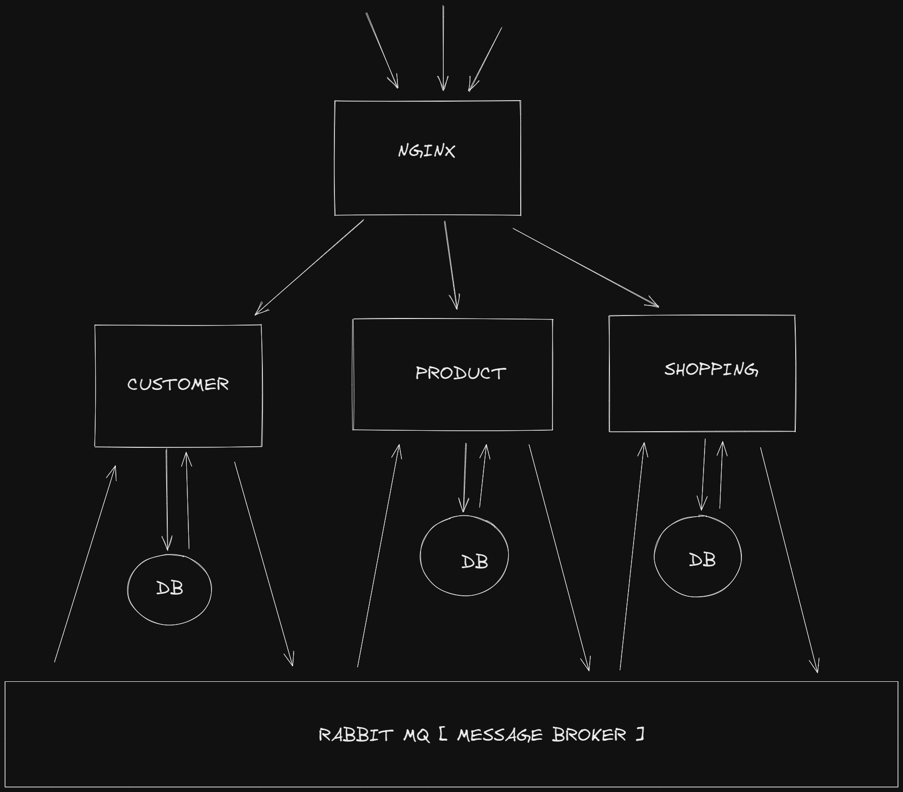

# Microservice Online Shopping
Built using express js, message broker using rabbitmq and containerized by docker. Now in progess to implement with service mesh paradigm in kubernetes cluster.
## Architecture

### **Clone Repository** 
```bash
git clone https://github.com/launathiel/microservice-online-shopping

cd microservice-online-shopping
```
---
## Run on Docker Using Docker Compose
### Run RabbitMQ 
```bash
docker-compose -f ./rabbitmq-docker.yml up -d
```
note that rabbitmq succesfully running, to avoid service error because rabbitmq, **after 1 minute** run command below;
### Run Service with DB
```bash
docker-compose -f ./service-with-db-docker.yml up -d
```
---
## Run on Kubernetes Cluster ( with Istio & RabbitMQ )
### Setup Istio
#### Download istio
```bash
curl -L https://istio.io/downloadIstio | sh -
```
#### Make file executable
```bash
chmod +x ./kubernetes/istio/istio-init.sh
```
#### execute sh file
```bash
./kubernetes/istio/istio-init.sh
```
#### check if istio successfully deployed
```bash
kubectl get all -n istio-system
```
---
### Setup Rabbitmq Cluster
#### Make file executable
```bash
chmod +x ./kubernetes/rabbitmq/rabbitmq.sh
```
#### execute sh file
```bash
./kubernetes/rabbitmq/rabbitmq.sh
```
#### Check all rabbitmq component
```bash
kubectl get all -o wide -n rabbitmq-system
kubectl get all -o wide -n rabbitmq
```
---
### Run **Customer** Service
#### Make file executable
```bash
chmod +x ./kubernetes/customer/mongodb.sh
chmod +x ./kubernetes/customer/customer.sh
```
#### Deploy customer database
```bash
./kubernetes/customer/mongodb.sh 
```
#### MongoDB init ( First Time Only )
```bash
kubectl exec -ti -n customer mongod-customer-0 bash

# initiate replicaset
mongo --quiet <<EOF
rs.initiate({ 
    _id : "MainRepSet", 
    version : 1, 
    members: [
        { _id: 0, host: "mongod-customer-0.mongodb-service.customer.svc.cluster.local:27017" }, 
        { _id: 1, host: "mongod-customer-1.mongodb-service.customer.svc.cluster.local:27017" }
    ]
});
EOF
# you can specify member of replicaset depend on your mongoDB sts' replica

# check 
mongo --eval 'rs.status();'

# create user admin
mongo --quiet <<EOF
db.getSiblingDB("admin").createUser({
    user : "customerdb",
    pwd  : "thisisasecret",
    roles: [ { role: "root", db: "admin" } ]
});
EOF

exit
```
#### Deploy customer service
```bash
./kubernetes/customer/customer.sh 
```
---
### Run **Products** Service
#### Make file executable
```bash
chmod +x ./kubernetes/products/mongodb.sh
chmod +x ./kubernetes/products/products.sh
```
#### Deploy products database
```bash
./kubernetes/products/mongodb.sh 
```
#### MongoDB init ( First Time Only )
```bash
kubectl exec -ti -n products mongod-products-0 bash

# initiate replicaset
mongo --quiet <<EOF
rs.initiate({ 
    _id : "MainRepSet", 
    version : 1, 
    members: [
        { _id: 0, host: "mongod-products-0.mongodb-service.products.svc.cluster.local:27017" }, 
        { _id: 1, host: "mongod-products-1.mongodb-service.products.svc.cluster.local:27017" }
    ]
});
EOF
# you can specify member of replicaset depend on your mongoDB sts' replica

# check 
mongo --eval 'rs.status();'

# create user admin
mongo --quiet <<EOF
db.getSiblingDB("admin").createUser({
    user : "productsdb",
    pwd  : "thisisasecret",
    roles: [ { role: "root", db: "admin" } ]
});
EOF

exit
```
#### Deploy products service
```bash
./kubernetes/products/products.sh 
```
---
### Run **Shopping** Service
#### Make file executable
```bash
chmod +x ./kubernetes/shopping/mongodb.sh
chmod +x ./kubernetes/shopping/shopping.sh
```
#### Deploy shopping database
```bash
./kubernetes/shopping/mongodb.sh 
```
#### MongoDB init ( First Time Only )
```bash
kubectl exec -ti -n shopping mongod-shopping-0 bash

# initiate replicaset
mongo --quiet <<EOF
rs.initiate({ 
    _id : "MainRepSet", 
    version : 1, 
    members: [
        { _id: 0, host: "mongod-shopping-0.mongodb-service.shopping.svc.cluster.local:27017" }, 
        { _id: 1, host: "mongod-shopping-1.mongodb-service.shopping.svc.cluster.local:27017" }
    ]
});
EOF
# you can specify member of replicaset depend on your mongoDB sts' replica

# check 
mongo --eval 'rs.status();'

# create user admin
mongo --quiet <<EOF
db.getSiblingDB("admin").createUser({
    user : "shoppingdb",
    pwd  : "thisisasecret",
    roles: [ { role: "root", db: "admin" } ]
});
EOF

exit
```
#### Deploy shopping service
```bash
./kubernetes/shopping/shopping.sh 
```

## Service Mesh Monitoring
### Prometheus
```bash
kubectl apply -n istio-system -f https://raw.githubusercontent.com/launathiel/microservice-online-shopping/main/kubernetes/istio/prometheus.yaml
```
### Grafana
```bash
kubectl apply -n istio-system -f https://raw.githubusercontent.com/launathiel/microservice-online-shopping/main/kubernetes/istio/grafana.yaml
```
### Kiali
```bash
kubectl apply -f https://raw.githubusercontent.com/launathiel/microservice-online-shopping/main/kubernetes/istio/kiali-crd.yaml
kubectl apply -n istio-system -f https://raw.githubusercontent.com/launathiel/microservice-online-shopping/main/kubernetes/istio/kiali.yaml
```

> keep exploring!
